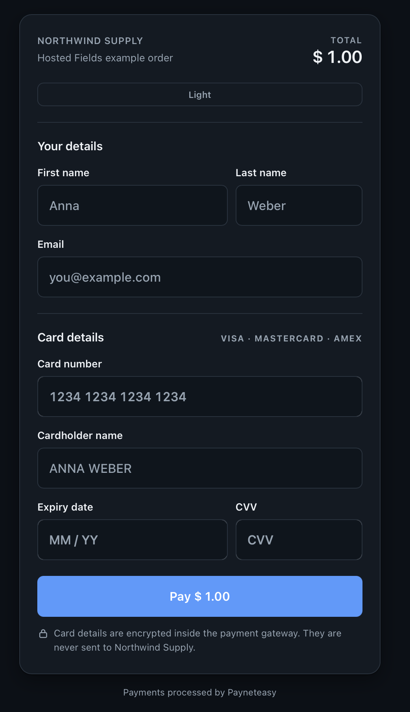
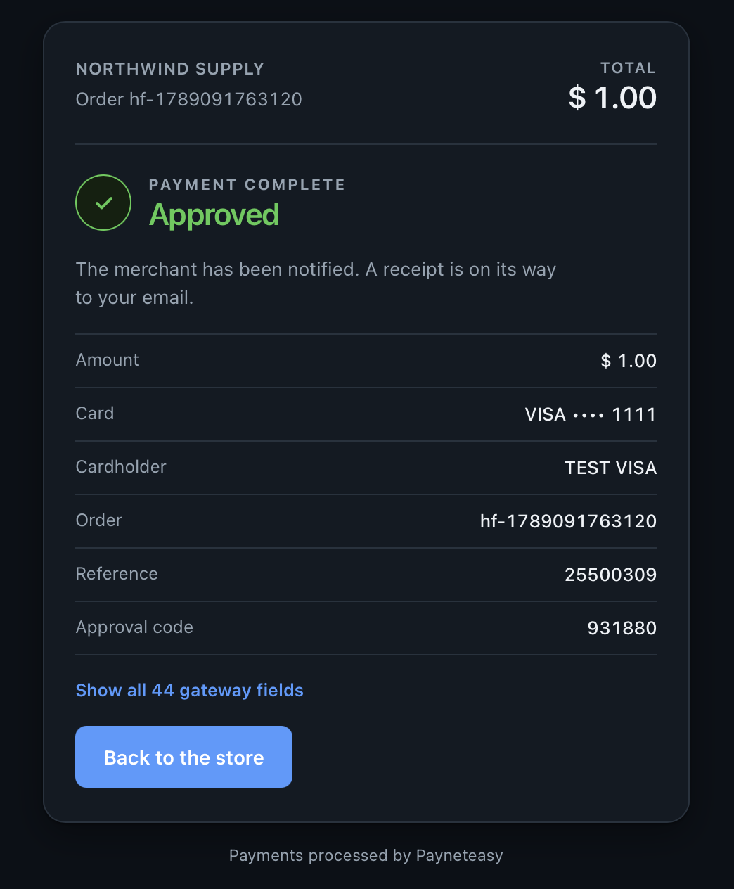

# Hosted Fields examples

Eleven working merchant integrations of [Hosted Fields][docs]: on Go, on Node.js, on PHP, on
Python, on Ruby, on Java, on Kotlin, on Rust, on .NET, on Next.js and on Go with a React page.
Same payment, same screens, same flow — what differs is the server language and, in the last two,
whether the page is a static file or a React tree.

## The examples

| | Server | Read the code | Start here |
| --- | --- | --- | --- |
| **Go** | Go 1.24+, standard library only | [`go-js/`](go-js/) | [`main.go`](go-js/main.go) routes · [`paynet.go`](go-js/paynet.go) the three gateway calls · [`oauth.go`](go-js/oauth.go) request signing |
| **Node.js** | Node 20+, express only | [`nodejs-express-js/`](nodejs-express-js/) | [`src/server.js`](nodejs-express-js/src/server.js) routes · [`src/paynet.js`](nodejs-express-js/src/paynet.js) the three gateway calls · [`src/oauth.js`](nodejs-express-js/src/oauth.js) request signing |
| **PHP** | PHP 8.4+, no Composer | [`php-js/`](php-js/) | [`index.php`](php-js/index.php) routes · [`paynet.php`](php-js/paynet.php) the three gateway calls · [`oauth.php`](php-js/oauth.php) request signing |
| **Python** | Python 3.12+, Flask | [`python-flask-js/`](python-flask-js/) | [`app.py`](python-flask-js/app.py) routes · [`paynet.py`](python-flask-js/paynet.py) the three gateway calls · [`oauth.py`](python-flask-js/oauth.py) request signing |
| **Ruby** | Ruby 3.1+, Sinatra | [`ruby-sinatra-js/`](ruby-sinatra-js/) | [`app.rb`](ruby-sinatra-js/app.rb) routes · [`paynet.rb`](ruby-sinatra-js/paynet.rb) the three gateway calls · [`oauth.rb`](ruby-sinatra-js/oauth.rb) request signing |
| **Java** | JDK 21+, Spring Boot | [`java-springboot-js/`](java-springboot-js/) | [`Routes.java`](java-springboot-js/src/main/java/com/payneteasy/hostedfields/Routes.java) routes · [`Paynet.java`](java-springboot-js/src/main/java/com/payneteasy/hostedfields/Paynet.java) the three gateway calls · [`OAuth.java`](java-springboot-js/src/main/java/com/payneteasy/hostedfields/OAuth.java) request signing |
| **Kotlin** | JDK 21+, Ktor | [`kotlin-ktor-js/`](kotlin-ktor-js/) | [`Routing.kt`](kotlin-ktor-js/src/main/kotlin/com/payneteasy/hostedfields/Routing.kt) routes · [`Paynet.kt`](kotlin-ktor-js/src/main/kotlin/com/payneteasy/hostedfields/Paynet.kt) the three gateway calls · [`OAuth.kt`](kotlin-ktor-js/src/main/kotlin/com/payneteasy/hostedfields/OAuth.kt) request signing |
| **Rust** | Rust 1.85+, axum | [`rust-axum-js/`](rust-axum-js/) | [`src/main.rs`](rust-axum-js/src/main.rs) routes · [`src/paynet.rs`](rust-axum-js/src/paynet.rs) the three gateway calls · [`src/oauth.rs`](rust-axum-js/src/oauth.rs) request signing |
| **.NET** | .NET 10+, ASP.NET Core, no NuGet package | [`dotnet-aspnetcore-js/`](dotnet-aspnetcore-js/) | [`Program.cs`](dotnet-aspnetcore-js/Program.cs) routes · [`Paynet.cs`](dotnet-aspnetcore-js/Paynet.cs) the three gateway calls · [`OAuth.cs`](dotnet-aspnetcore-js/OAuth.cs) request signing |
| **Next.js** | Node 20+, React 19, TypeScript | [`nextjs/`](nextjs/) | [`src/app/`](nextjs/src/app/) pages and route handlers · [`src/shared/lib/paynet.ts`](nextjs/src/shared/lib/paynet.ts) the three gateway calls · [`src/shared/ui/checkout-form.tsx`](nextjs/src/shared/ui/checkout-form.tsx) the page |
| **Go + React** | Go 1.24+ server, React 19 SPA | [`go-react/`](go-react/) | [`main.go`](go-react/main.go) routes · [`paynet.go`](go-react/paynet.go) the three gateway calls · [`web/src/shared/api/`](go-react/web/src/shared/api/) everything the page asks the server for |

The browser half lives once, in [`shared/`](shared/) —
[`checkout.js`](shared/public/checkout.js) sets up the fields and tokenizes,
[`status.js`](shared/public/status.js) polls the order,
[`checkout.html`](shared/views/checkout.html) is the page — and
[`scripts/sync-shared.sh`](scripts/sync-shared.sh) copies it into every app, byte for byte.
That is the point of having more than one: everything interesting about Hosted Fields happens
in the page, and the server behind it is interchangeable. Pick whichever language you work in
and ignore the others.

The last two answer the other question — what this looks like when the page is React. They
cannot share those files, so they are ported to components, but they serve the very same
[`public/styles.css`](go-js/public/styles.css) and the screens are the same to the pixel. Their
common subject is the seam: an SDK that injects cross-origin iframes imperatively, into elements
React also owns. See [nextjs/README.md](nextjs/README.md#react-and-a-cross-origin-sdk).

They differ in where that leaves the server. [`nextjs/`](nextjs/) puts both halves in one
framework and one `src/` tree, which is the ordinary way to build it and the reason it is hard to
tell by looking which file runs where. [`go-react/`](go-react/) is the same page as a plain
single-page application in [`web/`](go-react/web/), in front of a Go server that is `go-js`'s
near enough to diff — so the boundary is a directory line and an HTTP request, and the only
things that cross it are one generated `<script>` and two `fetch` calls.

## What it looks like

| Checkout | After the payment |
| --- | --- |
|  |  |

Look at the card section on the left. Card number, expiry and CVV are iframes from the gateway —
but **Cardholder name, sitting between them, is the merchant's own `<input>`**, in the same
visual row and the same style. That is what Hosted Fields buy you and what a redirect to a hosted
payment page cannot do.

## Download a built example

No build needed — each archive holds a ready binary. These links always point at the newest
release; the [releases page](https://github.com/payneteasy/hosted-fields-examples/releases) has
the older ones and the checksums.

| Example | Platform | Download | Then |
| --- | --- | --- | --- |
| Go | Linux x86-64 | [`..._linux_amd64.tar.gz`](https://github.com/payneteasy/hosted-fields-examples/releases/latest/download/hosted-fields-examples-go_linux_amd64.tar.gz) | `tar -xzf`, set the environment, run the binary |
| Go | Linux arm64 | [`..._linux_arm64.tar.gz`](https://github.com/payneteasy/hosted-fields-examples/releases/latest/download/hosted-fields-examples-go_linux_arm64.tar.gz) | the same |
| Go | macOS Apple silicon | [`..._darwin_arm64.tar.gz`](https://github.com/payneteasy/hosted-fields-examples/releases/latest/download/hosted-fields-examples-go_darwin_arm64.tar.gz) | `tar -xzf`, then `xattr -d com.apple.quarantine hosted-fields-examples-go` — the binary is not notarised |
| Go | Windows x64 | [`..._windows_amd64.zip`](https://github.com/payneteasy/hosted-fields-examples/releases/latest/download/hosted-fields-examples-go_windows_amd64.zip) | unzip, set the environment, run the `.exe` |
| Node.js | any | [`...nodejs-express-js.tar.gz`](https://github.com/payneteasy/hosted-fields-examples/releases/latest/download/hosted-fields-examples-nodejs-express-js.tar.gz) | `tar -xzf`, then `node server.js` — needs Node 20+, no `npm install` |
| PHP | any | [`...php.tar.gz`](https://github.com/payneteasy/hosted-fields-examples/releases/latest/download/hosted-fields-examples-php.tar.gz) | `tar -xzf`, then `php -S 127.0.0.1:3003 router.php` — needs PHP 8.4+, no Composer |
| Python | any | [`...python.tar.gz`](https://github.com/payneteasy/hosted-fields-examples/releases/latest/download/hosted-fields-examples-python.tar.gz) | `tar -xzf`, then `pip install -r requirements.txt` in a venv and `python app.py` — needs Python 3.12+ |
| Ruby | any | [`...ruby.tar.gz`](https://github.com/payneteasy/hosted-fields-examples/releases/latest/download/hosted-fields-examples-ruby.tar.gz) | `tar -xzf`, then `bundle install` and `bundle exec ruby app.rb` — needs Ruby 3.1+, not macOS's 2.6 |
| Java | any | [`...java.tar.gz`](https://github.com/payneteasy/hosted-fields-examples/releases/latest/download/hosted-fields-examples-java.tar.gz) | `tar -xzf`, then `java -jar hosted-fields-example-java.jar` — needs a JRE 21+ and nothing else, the pages are inside the jar |
| Kotlin | any | [`...kotlin.tar.gz`](https://github.com/payneteasy/hosted-fields-examples/releases/latest/download/hosted-fields-examples-kotlin.tar.gz) | `tar -xzf`, then `java -jar hosted-fields-example-kotlin.jar` — needs a JRE 21+ and nothing else, the pages are inside the jar |
| Rust | Linux x86-64 | [`..._linux_amd64.tar.gz`](https://github.com/payneteasy/hosted-fields-examples/releases/latest/download/hosted-fields-examples-rust_linux_amd64.tar.gz) | `tar -xzf`, set the environment, run the binary — the pages are inside it |
| Rust | Linux arm64 | [`..._linux_arm64.tar.gz`](https://github.com/payneteasy/hosted-fields-examples/releases/latest/download/hosted-fields-examples-rust_linux_arm64.tar.gz) | the same |
| Rust | macOS Apple silicon | [`..._darwin_arm64.tar.gz`](https://github.com/payneteasy/hosted-fields-examples/releases/latest/download/hosted-fields-examples-rust_darwin_arm64.tar.gz) | `tar -xzf`, then `xattr -d com.apple.quarantine hosted-fields-example-rust` — the binary is not notarised |
| Rust | Windows x64 | [`..._windows_amd64.zip`](https://github.com/payneteasy/hosted-fields-examples/releases/latest/download/hosted-fields-examples-rust_windows_amd64.zip) | unzip, set the environment, run the `.exe` |
| .NET | any | [`...dotnet.tar.gz`](https://github.com/payneteasy/hosted-fields-examples/releases/latest/download/hosted-fields-examples-dotnet.tar.gz) | `tar -xzf`, then `dotnet hosted-fields-example-dotnet.dll` — needs the .NET 10 runtime and nothing else, the pages are inside the assembly |
| Next.js | any | [`...nextjs.tar.gz`](https://github.com/payneteasy/hosted-fields-examples/releases/latest/download/hosted-fields-examples-nextjs.tar.gz) | the same, `node server.js` — but the URL prefix is compiled in, so rebuild from source to change it |
| Go + React | Linux x86-64 | [`..._linux_amd64.tar.gz`](https://github.com/payneteasy/hosted-fields-examples/releases/latest/download/hosted-fields-examples-go-react_linux_amd64.tar.gz) | `tar -xzf`, set the environment, run the binary — the React page is inside it, prefix and all settings still at runtime |
| Go + React | Linux arm64 | [`..._linux_arm64.tar.gz`](https://github.com/payneteasy/hosted-fields-examples/releases/latest/download/hosted-fields-examples-go-react_linux_arm64.tar.gz) | the same |
| Go + React | macOS Apple silicon | [`..._darwin_arm64.tar.gz`](https://github.com/payneteasy/hosted-fields-examples/releases/latest/download/hosted-fields-examples-go-react_darwin_arm64.tar.gz) | `tar -xzf`, then `xattr -d com.apple.quarantine hosted-fields-examples-go-react` — the binary is not notarised |
| Go + React | Windows x64 | [`..._windows_amd64.zip`](https://github.com/payneteasy/hosted-fields-examples/releases/latest/download/hosted-fields-examples-go-react_windows_amd64.zip) | unzip, set the environment, run the `.exe` |

The Linux archives also carry `deploy/` with a systemd unit, an nginx snippet and an environment
template. The macOS and Windows builds do not: those are for trying the example on a laptop.

Or clone the repository and run from source — see [Run](#run) below.

## What Hosted Fields buy you

The card number, expiry date and CVV are `<iframe>`s served by the payment gateway. They are not
your inputs, your page cannot read them, and the card never reaches your server — so your server
stays out of PCI scope.

The layout, the copy, the light and dark themes and the result panel are all yours; only the
three boxes holding card data are not.

## The flow

Identical in every example. `{prefix}` is the URL prefix each app is mounted under.

| # | Where | What happens |
| - | ----- | ------------ |
| 1 | `GET {prefix}/` and `{prefix}/config.js` | the page, then the config it needs — including a single-use `ephemeralTicket`, fresh on every load |
| 2 | browser | the SDK creates the `pan` / `exp` / `cvv` iframes; `sdk.tokenize(ticket)` exchanges the card for a `hostedFieldsToken` |
| 3 | `POST {prefix}/pay` | the server sends a Sale with `hosted_fields_token` in place of the card parameters |
| 4 | `GET {prefix}/status` | the page polls the order status every four seconds until a final status |
| 5 | `POST {prefix}/result/callback` | where the gateway returns the payer after a 3DS challenge; its `control` checksum is verified, then a `303` to the page with the same signed parameters |
| 6 | `GET {prefix}/result` | the return page; the checksum is verified again before anything is served, so an edited URL gets a `403` |

The page itself is never generated. The server hands it `window.CONFIG` as a separate
`{prefix}/config.js` — a fresh single-use ticket per page load — and that is the only thing any
of these servers generates. It is what lets the same HTML file serve from every one of them.

The card data goes from the iframes straight to the gateway. Your server only ever sees a token.

## Before you start

Ask the gateway for these. Every one is per-installation, and none of them belong in this repository:

| | |
| --- | --- |
| `API_URL` | the gateway root, e.g. `https://<gateway-host>/paynet` |
| `SDK_URL` | the Hosted Fields script, on that same host — the SDK refuses to run when served from the merchant origin |
| `ENDPOINT_ID` | the endpoint the payments go to |
| `MERCHANT_LOGIN` | signs the API calls as `oauth_consumer_key` |
| `MERCHANT_CONTROL` | shared secret; the 3DS return callback is verified against it |
| RSA private key | PKCS#8, signs every server call |

Put the key next to the app as `private_key.pem` or point `PRIVATE_KEY_PATH` at it. `*.pem`,
`*.key` and `.env` are git-ignored repository wide — keep it that way.

None of these have defaults. Every example refuses to serve a payment until all of them are set,
rather than falling back to a host baked in at some point and forgotten. Go, Express, Flask,
Sinatra, Spring Boot, Ktor, axum and ASP.NET Core check at startup; Next checks on the first
request, so that a build needs no credentials, and PHP on every request, because it has no startup
to check at.

## Run all eleven at once

That "behind one nginx" is not a figure of speech, and `docker-compose.yml` is it: eleven images,
one nginx, no toolchain to install.

```bash
cp .env.example .env                    # the gateway URLs and your credentials
cp your_key.pem private_key.pem         # PKCS#8 — the JDK reads nothing else
docker compose up --build               # http://localhost:8080/
```

The front page lists all eleven. Each is routed by **its own [`deploy/nginx.conf`](go-js/deploy/nginx.conf)**,
mounted unmodified — so this is also what checks that the file in every release archive is
correct, which nothing else does.

It is a demo and not a deployment: plain HTTP on a local port. The first build is slow — it
compiles Rust, packages a Spring Boot jar and runs both `next build` and an Rsbuild build. Set `HTTP_PORT` in `.env` if
something already has 8080 — it drives the published port, nginx's own and `PUBLIC_URL` at once —
and restart the stack rather than one service, because every app shares the nginx container's
network namespace, which is what lets the shipped snippets be used unchanged.

This stack has a second job: it is also what `e2e-tests/` can run its browser tests against, so
checking an example end to end needs Docker and no toolchain at all. See below.

## Run one on its own

They all mount everything under a URL prefix, so they can sit behind one nginx at once, and they
all listen on `127.0.0.1` by default — they speak plain HTTP and trust `X-Forwarded-For`, so a
proxy belongs in front.

```bash
# Go — needs Go 1.24+, no dependencies at all
cd go-js
cp .env.example .env          # fill in the gateway URLs and your credentials
go run .                      # http://localhost:3001/hosted-fields-examples-go/
```

```bash
# Node.js — needs Node 20+, one dependency (express)
cd nodejs-express-js
npm install
cp .env.example .env          # the same values
npm start                     # http://localhost:3000/hosted-fields-examples-nodejs-express-js/
```

```bash
# PHP — needs PHP 8.4+ with curl and openssl, no Composer
cd php-js
cp .env.example .env          # the same values
php -S 127.0.0.1:3003 router.php   # http://localhost:3003/hosted-fields-examples-php/
```

```bash
# Python — needs Python 3.12+
cd python-flask-js
python3 -m venv .venv && .venv/bin/pip install -r requirements.txt
cp .env.example .env          # the same values
.venv/bin/python app.py       # http://localhost:3004/hosted-fields-examples-python/
```

```bash
# Ruby — needs Ruby 3.1+ (macOS ships 2.6, which Sinatra 4 will not run on)
cd ruby-sinatra-js
bundle install
cp .env.example .env          # the same values
bundle exec ruby app.rb       # http://localhost:3005/hosted-fields-examples-ruby/
```

```bash
# Java — needs a JDK 21+; ./mvnw is the Maven wrapper, so no Maven has to be installed
cd java-springboot-js
cp .env.example .env          # the same values
./mvnw spring-boot:run        # http://localhost:3006/hosted-fields-examples-java/
```

```bash
# Kotlin — needs a JDK 21+; ./gradlew is the Gradle wrapper, so no Gradle has to be installed
cd kotlin-ktor-js
cp .env.example .env          # the same values
./gradlew run                 # http://localhost:3009/hosted-fields-examples-kotlin/
```

```bash
# Rust — needs Rust 1.85+; rustls with the ring provider, so no OpenSSL and no cmake to install
cd rust-axum-js
cp .env.example .env          # the same values
cargo run                     # http://localhost:3007/hosted-fields-examples-rust/
```

```bash
# .NET — needs the .NET 10 SDK; no NuGet package to restore for the app itself
cd dotnet-aspnetcore-js
cp .env.example .env          # the same values
dotnet run                    # http://localhost:3008/hosted-fields-examples-dotnet/
```

```bash
# Next.js — needs Node 20+, yarn
cd nextjs
yarn install
cp .env.example .env          # the same values again
yarn dev                      # http://localhost:3002/hosted-fields-examples-nextjs/
```

```bash
# Go + React — needs Go 1.24+ and Node 20+ with yarn; the page is built into the binary
cd go-react
(cd web && yarn install && yarn build)
cp .env.example .env          # the same values again
go run .                      # http://localhost:3010/hosted-fields-examples-go-react/
```

Sandbox test card: `4444 4444 4444 4448`, any future expiry, CVV `123`.

Each app has its own README with the details — settings, the 3DS return, deployment behind nginx:
[go-js/README.md](go-js/README.md) · [nodejs-express-js/README.md](nodejs-express-js/README.md) ·
[php-js/README.md](php-js/README.md) · [python-flask-js/README.md](python-flask-js/README.md) ·
[ruby-sinatra-js/README.md](ruby-sinatra-js/README.md) ·
[java-springboot-js/README.md](java-springboot-js/README.md) ·
[kotlin-ktor-js/README.md](kotlin-ktor-js/README.md) ·
[rust-axum-js/README.md](rust-axum-js/README.md) ·
[dotnet-aspnetcore-js/README.md](dotnet-aspnetcore-js/README.md) ·
[nextjs/README.md](nextjs/README.md) ·
[go-react/README.md](go-react/README.md)

## Layout

```
shared/                 the browser half, once
scripts/sync-shared.sh  copies it into every app
docker-compose.yml      all eleven at once, behind one nginx
docker/nginx/           the server block the eleven shipped snippets are included into
go-js/                  Go + plain JS, assets embedded in the binary
nodejs-express-js/      Node.js + Express + plain JS
php-js/                 PHP + plain JS, no Composer
python-flask-js/        Python + Flask + plain JS
ruby-sinatra-js/        Ruby + Sinatra + plain JS
java-springboot-js/     Java + Spring Boot + plain JS, assets packaged into the jar
kotlin-ktor-js/         Kotlin + Ktor + plain JS, assets packaged into the jar
rust-axum-js/           Rust + axum + plain JS, assets compiled into the binary
dotnet-aspnetcore-js/   .NET + ASP.NET Core + plain JS, assets embedded in the assembly
nextjs/                 Next.js + React + TypeScript
go-react/               Go server + React SPA, the bundle embedded in the binary
e2e-tests/              a fake gateway, and every app driven through a browser
```

The copies stay committed, so every app directory runs on its own with no pre-step and the
release archives carry nothing extra. Editing one directly is the mistake to avoid:

```bash
# edit shared/, then
./scripts/sync-shared.sh
```

CI runs that script and then `git diff --exit-code`, so an unsynced copy fails the push. There
is no per-file list anywhere and no line that is allowed to differ — the config injection left
the HTML and became `config.js`, which is why a fourth or a tenth language costs nothing here.

`nextjs/` and `go-react/web/` take only `styles.css`: their scripts and views are React
components. That one shared file is what keeps them from looking different.

## What an example leaves for you

Everything above is the integration. These are the parts a shop needs and an example does not
have, listed so that copying this code does not quietly copy the gaps too:

- **`GET /status` is not authorised.** It takes the two order ids from the query and asks the
  gateway with the merchant's own credentials, so anyone holding those ids can read the order —
  card last four, holder, bank message. The ids are random rather than sequential, which makes
  them impractical to guess, but that is not the same as a check. A shop should tie the order to
  a payer session or a signed cookie and serve the status only to the session that paid.
- **Nothing is stored.** There is no order table and no ledger: the page polls the gateway and
  the page is all there is. A shop reconciles against its own records.
- **Nothing is rate limited.** Each page load spends an ephemeral ticket, and nothing stops a
  caller from loading the page in a loop.
- **The billing address in the Sale is demo data** — the Seattle address in every `paynet.*` is
  there so the call is complete. Send the payer's real one.
- **The apps bind to `127.0.0.1`** and take `X-Forwarded-For` on trust, because they speak plain
  HTTP and expect nginx in front. Exposed directly, the address the gateway screens for fraud
  becomes whatever the caller says it is.

## A note on the payer-facing language

This repository is English throughout. The payer can still see another language: field validation
messages come from the SDK bundle the gateway serves, as `error.payerMessage`, not from this code.
If you show the payer text in a language of your own, switch on `error.code` and supply your own
string — codes are stable and are never reused.

## Checking them all at once

The examples are the same payment written once per language, and `e2e-tests/` is what checks that
they still are. It starts a fake gateway on one local origin — the API the servers call and the
Hosted Fields SDK the browser loads — points every app at it with environment variables, and
drives a real browser through the payment.

```bash
cd e2e-tests
npm install && npm run browser   # once

npm test                         # starts each app itself — needs its toolchain
npm run test:dotnet              # .NET is asked for by name, not part of `npm test`

npm run test:docker              # the same specs against the compose stack — all eleven
npm run test:docker:java         # or one of them, by its short name
```

The two ways run the same specs against the same fake gateway; what differs is where the
applications come from. Natively Playwright starts each one, which is why a run needs that
toolchain installed and why .NET is opt-in. Against the containers there is nothing to install but
Docker, so all eleven run — including .NET — and the stack comes up and goes down with the run,
under its own project name so a demo stack on `:8080` is left alone.

It runs locally only, not in CI. The signatures and the 3DS checksum are verified rather than
accepted, so a green run means the whole handshake works and not just that a page rendered. See
[`e2e-tests/README.md`](e2e-tests/README.md).

## Documentation

- [Hosted Fields integration][docs] — the flow, the SDK, error codes, appearance and restrictions
- [OAuth RSA-SHA256 signing](https://doc.payneteasy.com/integration/general_api_usage/request_authentication_methods/oauth.html)
- [Merchant callback parameters](https://doc.payneteasy.com/integration/API_commands/merchant_callback_parameters.html)

[docs]: https://doc.payneteasy.com/integration/api_use_cases/hosted_fields.html
